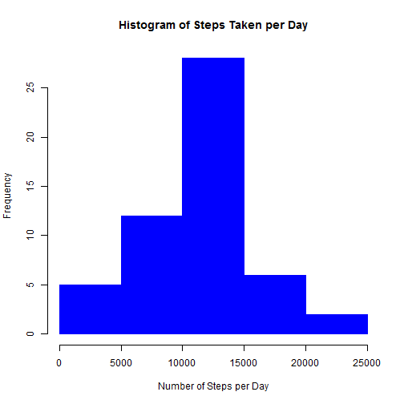
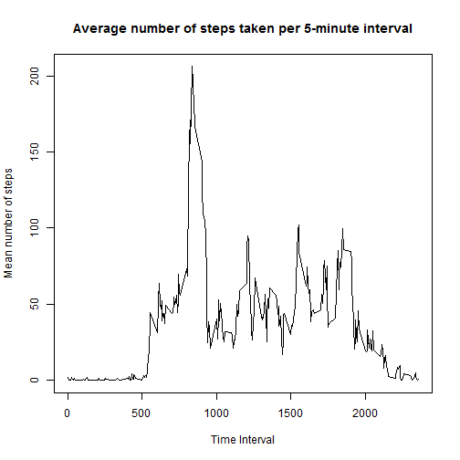
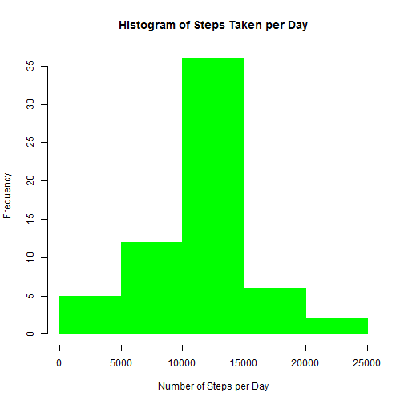
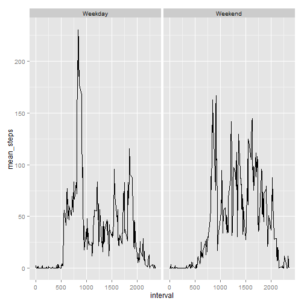

Reproducible Research - Assignment 1
====================================

**Loading and preprocessing the data**


```r
library(dplyr)
```

```
## Warning: package 'dplyr' was built under R version 3.2.2
```

```
## 
## Attaching package: 'dplyr'
```

```
## The following objects are masked from 'package:stats':
## 
##     filter, lag
```

```
## The following objects are masked from 'package:base':
## 
##     intersect, setdiff, setequal, union
```

```r
library(ggplot2)
```

```
## Warning: package 'ggplot2' was built under R version 3.2.3
```

```r
activity <- read.table("activity.csv",header=TRUE,sep=",")
```

**1. What is mean total number of steps taken per day?**

Summarize by day


```r
activity_by_day <- summarise(group_by(activity,date),sum_steps=sum(steps))
```

Produce the histogram


```r
hist(activity_by_day$sum_steps,col="blue",border="blue",main="Histogram of Steps Taken per Day",xlab="Number of Steps per Day")
```



Derive the mean


```r
by_day_mean <- mean(activity_by_day$sum_steps,na.rm=TRUE)
by_day_mean
```

```
## [1] 10766.19
```

Derive the median


```r
by_day_median <- median(activity_by_day$sum_steps,na.rm=TRUE)
by_day_median
```

```
## [1] 10765
```

**2. What is the average daily activity pattern?**

Summarize by interval


```r
activity_by_interval <- summarise(group_by(activity,interval),mean_steps=mean(steps,na.rm=TRUE))
```

Produce the time series plot


```r
plot(activity_by_interval,type="l",main="Average number of steps taken per 5-minute interval",xlab="Time Interval",ylab="Mean number of steps")
```



Which 5-minute interval, on average across all the days in the dataset, contains the maximum number of steps?


```r
max_steps <- subset(activity_by_interval,mean_steps==max(activity_by_interval$mean_steps))
max_steps
```

```
## Source: local data frame [1 x 2]
## 
##   interval mean_steps
##      (int)      (dbl)
## 1      835   206.1698
```

**3. Imputing missing values**

Calculate and report the total number of missing values in the dataset


```r
number_missing <- sum(is.na(activity$steps))
number_missing
```

```
## [1] 2304
```

Devise a strategy for filling in all of the missing values in the dataset.   
    - Use the mean for the interval already calculated above

Create a new dataset that is equal to the original dataset but with the missing data filled in.


```r
activity2 <- activity

for (i in 1:dim(activity)[1]) {
    if (is.na(activity$steps[i])) {
        activity2$steps[i] <- subset(activity_by_interval,interval==activity$interval[i])[,2]

}
}
activity2$steps <- as.numeric(activity2$steps)
```

Summarize by day


```r
activity2_by_day <- summarise(group_by(activity2,date),sum_steps=sum(steps))
```

Produce the histogram


```r
hist(activity2_by_day$sum_steps,col="green",border="green",main="Histogram of Steps Taken per Day",xlab="Number of Steps per Day")
```



Derive the mean


```r
by_day_mean2 <- mean(activity2_by_day$sum_steps)
by_day_mean2
```

```
## [1] 10766.19
```

Derive the median


```r
by_day_median2 <- median(activity2_by_day$sum_steps)
by_day_median2
```

```
## [1] 10766.19
```


Do these values differ from the estimates from the first part of the assignment?


```r
means_change <- !(by_day_mean == by_day_mean2)
means_change
```

```
## [1] FALSE
```

```r
medians_change <- !(by_day_median == by_day_median2)
medians_change
```

```
## [1] TRUE
```

What is the impact of imputing missing data on the estimates of the total daily number of steps?   
    - The mean doesn't change since the imputed data was the mean, but the median has moved due to additional data points.

**4. Are there differences in activity patterns between weekdays and weekends?**

Add the factor for weekday or weekend


```r
activity3 <- activity2
for (i in 1:dim(activity2)[1]) {
    dayofweek <- weekdays(as.POSIXct(activity2$date[i]))
    if (dayofweek == "Saturday" | dayofweek == "Sunday") {
        activity3$daytype[i] <- "Weekend"}
    else {
        activity3$daytype[i] <- "Weekday"}
}
```

Summarize by interval and day type


```r
activity_by_daytype <- summarise(group_by(activity3,interval,daytype),mean_steps=mean(steps))
```

Produce the plot


```r
qplot(interval, mean_steps, data=activity_by_daytype, facets=.~daytype,geom="path")
```


    
**THE END**
